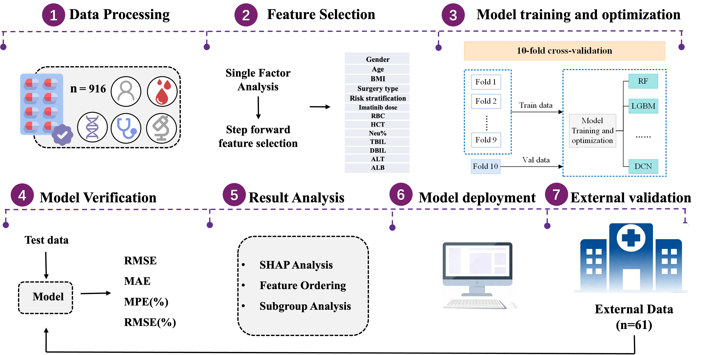

# ImaCmin-ML

## 📌 Project Introduction
This repository provides the official implementation code for the research paper:

_**A machine learning model for predicting plasma concentration of imatinib in patients with gastrointestinal stromal tumor based on real-world data**_

We aim to build a high-accuracy ML model to predict imatinib trough concentration (Cmin) in GIST patients, supporting clinical personalized dosing.

## 🖼 Model Architecture

## 🎯 Objective
Imatinib (IM) is the first-line treatment for gastrointestinal stromal tumors (GIST), and its efficacy and toxicity are closely related to plasma trough concentration (Cmin).
This study develops a machine learning model to predict IM Cmin using real-world data to support clinical personalized medication decisions.

## 🧬 What This Code Does ✨
- **Feature selection** using univariate analysis and sequential forward selection (SFS) 🔍
- **Missing value imputation** based on random forest 🌲
- **10 machine learning models** training, comparison, and evaluation 🤖

## 📂 Code Structure
- `feature_selection.py` → Feature engineering and variable selection codes
- `rf_imputation.py` → Random forest-based missing value imputation
- `model_*.py` → Training and evaluation codes for all machine learning models

## 🔬 Key Results
- 13 clinical variables selected for prediction
- CatBoost model achieved **90.22%** accuracy in training set
- External validation accuracy reached **85.25%**
- IM dose, RBC, HCT, TBIL, ALB were the most important features
- Validated in 425 training patients and 61 external patients

## 📋 Workflow
1. Data preprocessing & missing value imputation
2. Feature screening and selection
3. ML model training & 10-fold cross-validation
4. Model comparison & optimal model selection
5. SHAP interpretation & external validation

## 📧 Citation
If you use this code in your research, please cite our paper:
> A machine learning model for predicting plasma concentration of imatinib in patients with gastrointestinal stromal tumor based on real-world data
